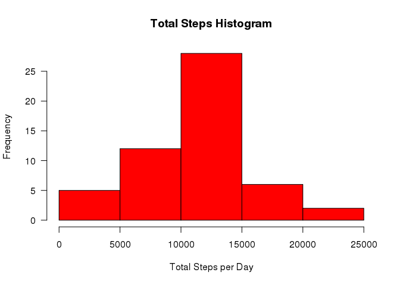
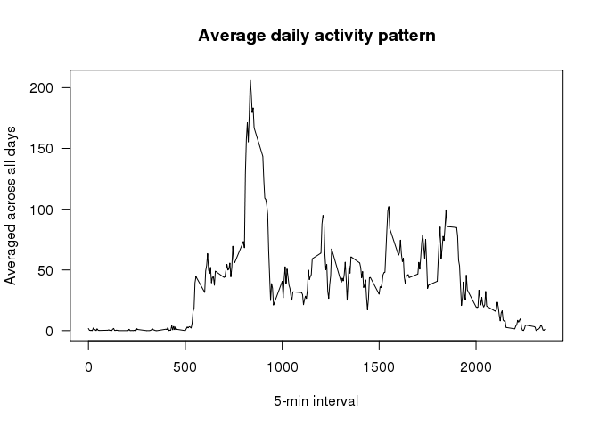
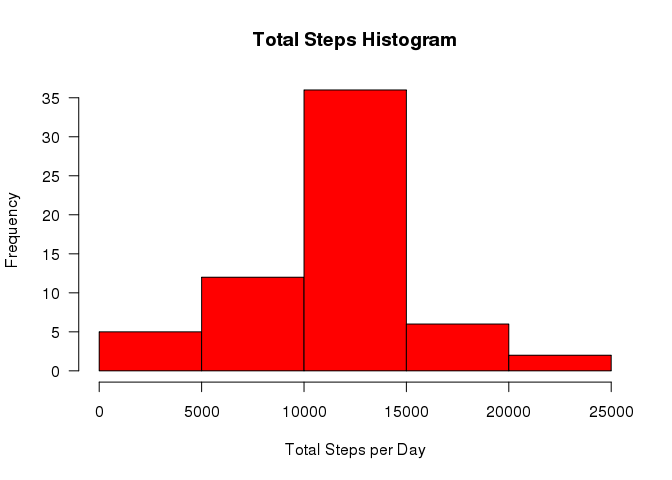
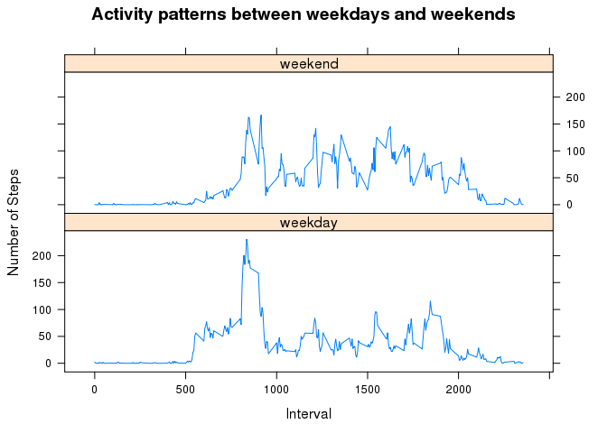

Reproducible Research Peer Assessments 1
========================================
## Loading and preprocessing the data

Load the data (i.e. read.csv())

```r
activityDF<-read.csv("activity.csv")
```

Process/transform the data (if necessary) into a format suitable for your analysis.
This is to convert date column to date format.

```r
activityDF$date<-as.Date(activityDF$date)
```

## What is mean total number of steps taken per day?

Calculate the total number of steps taken per day

```r
stepsbyday <- aggregate(steps~date, data=activityDF, FUN=sum, na.rm=TRUE)
```

Make a histogram of the total number of steps taken each day

```r
hist(stepsbyday$steps,col="red",las=1,main="Total Steps Histogram",xlab="Total Steps per Day")
```

 

Calculate and report the mean and median of the total number of steps taken per day

```r
paste("mean = ",mean(stepsbyday$steps), ", median = ",median(stepsbyday$steps))
```

```
## [1] "mean =  10766.1886792453 , median =  10765"
```

## What is the average daily activity pattern?

Make a time series plot (i.e. type = "l") of the 5-minute interval (x-axis) and the average number of steps taken, averaged across all days (y-axis)

```r
activity_daily<-tapply(activityDF$steps,activityDF$interval, mean, na.rm=TRUE)
plot(row.names(activity_daily),activity_daily, type="l", main="Average daily activity pattern", xlab="5-min interval",ylab="Averaged across all days",las=1)
```

 

Which 5-minute interval, on average across all the days in the dataset, contains the maximum number of steps?

```r
names(which.max(activity_daily))
```

```
## [1] "835"
```

## Inputing missing values

Calculate and report the total number of missing values in the dataset (i.e. the total number of rows with NAs)

```r
sum(is.na(activityDF$steps))
```

```
## [1] 2304
```

Devise a strategy for filling in all of the missing values in the dataset. The strategy does not need to be sophisticated. For example, you could use the mean/median for that day, or the mean for that 5-minute interval, etc.

Create a new dataset that is equal to the original dataset but with the missing data filled in.

The missing data are filled in based on the mean for that 5-minute interval which is calculated from previous queston.

```r
na_values <-is.na(activityDF$steps)
activityDF_a <- activityDF
activityDF_a$steps[na_values] <-activity_daily[as.character(activityDF_a$interval[na_values])] 
```

Make a histogram of the total number of steps taken each day and Calculate. Do these values differ from the estimates from the first part of the assignment? What is the impact of inputing missing data on the estimates of the total daily number of steps?

```r
stepsbyday_a <- aggregate(steps~date, data=activityDF_a, FUN=sum, na.rm=TRUE)
hist(stepsbyday_a$steps,col="red",las=1,main="Total Steps Histogram",xlab="Total Steps per Day")
```

 

Report the mean and median total number of steps taken per day

```r
paste("mean = ",mean(stepsbyday_a$steps),", median = ",median(stepsbyday_a$steps))
```

```
## [1] "mean =  10766.1886792453 , median =  10766.1886792453"
```
The impact to mean and median is minimal.

## Are there differences in activity patterns between weekdays and weekends?

Create a new factor variable in the dataset with two levels – “weekday” and “weekend” indicating whether a given date is a weekday or weekend day.

```r
library(timeDate)
activityDF_a$weekday <- isWeekday(activityDF_a$date)
stepsbyday_b <- aggregate(steps~interval + weekday, data = activityDF_a, mean)
stepsbyday_b$wkd <-as.factor(ifelse(stepsbyday_b$weekday,"weekday","weekend"))
```

Make a panel plot containing a time series plot (i.e. type = "l") of the 5-minute interval (x-axis) and the average number of steps taken, averaged across all weekday days or weekend days (y-axis). See the README file in the GitHub repository to see an example of what this plot should look like using simulated data.

```r
library("lattice")
xyplot(steps ~ interval | wkd, stepsbyday_b, type="l", layout=c(1,2),main="Activity patterns between weekdays and weekends", xlab="Interval",ylab="Number of Steps")
```

 
